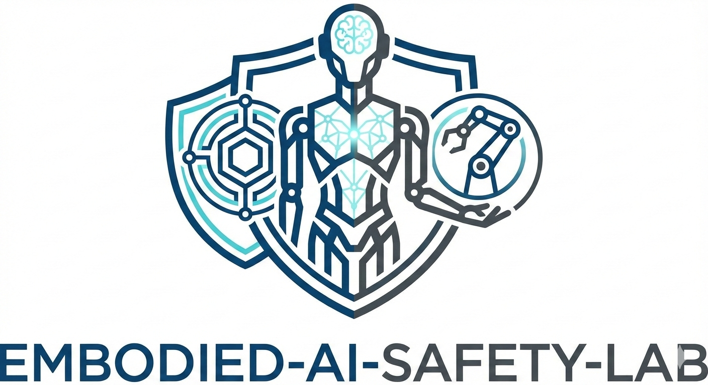

  
  
  <h1>Embodied AI Safety Lab</h1>
  
  

    <strong>Ensuring the Robustness, Security, and Alignment of Intelligent Agents in the Physical World.</strong>
  

  

    
    
    
     
  

---

## 🔬 About Us

Welcome to the **Embodied AI Safety Lab**. We are dedicated to bridging the gap between advanced artificial intelligence and safe physical deployment. Our research focuses on identifying vulnerabilities in robotic perception and control, developing robust defense mechanisms, and ensuring human-robot value alignment.

### 🛡️ Our Core Research Areas
| **Robust Perception** | **Safe Reinforcement Learning** | **Sim2Real Transfer** | **Adversarial Security** |
|:---:|:---:|:---:|:---:|
| 👁️ | 🧠 | 🌉 | ⚔️ |
| Defending vision systems against environmental perturbations and attacks. | Constrained exploration and safe policy optimization for robotics. | Ensuring safety guarantees hold when moving from simulation to reality. | Testing physical agents against adversarial examples and sensor spoofing. |

---

## 📢 News & Updates

* **[2024-05]** 🎉 Two papers accepted to **ICRA 2024** regarding safe navigation!
* **[2024-02]** 🏆 Our paper on *Adversarial Robotic Vision* won the Best Paper Award at the AI Safety Workshop.
* **[2023-12]** 🚀 We have released the `SafeBench` simulation environment v1.0.

---

## 📚 Featured Publications

### 2024
* **"Towards Provable Safety in Embodied Agents via Control Barrier Functions"**
    * *Alice Chen, Bob Smith, Carol Zhang*
    * **ICRA 2024**
    * [📄 PDF](#) | [💻 Code](#) | [🌐 Project Page](#)

* **"Attack-Resilient Visual Servoing for Manipulators"**
    * *David Lee, Alice Chen*
    * **CVPR 2024**
    * [📄 PDF](#) | [💻 Code](#) | [🌐 Project Page](#)

### 2023
* **"Benchmarking Robustness in Vision-Language Navigation"**
    * *Team Member A, Team Member B*
    * **NeurIPS 2023 (Oral)**
    * [📄 PDF](#) | [💻 Code](#) | [🌐 Project Page](#)

---

## 💻 Open Source Projects

We believe in open science. Here are some of our maintained repositories:

| Project | Description | Tech Stack |
| :--- | :--- | :--- |
| **[🤖 RoboGuard](#)** | An adversarial attack toolbox specifically designed for robotic perception pipelines. | `Python` `PyTorch` `ROS` |
| **[🛑 Safety-Gym-Real](#)** | A suite of safety-critical benchmarks for real-world quadruped robots. | `MuJoCo` `Isaac Gym` |
| **[🧠 Verifiable-RL](#)** | Formal verification tools for deep reinforcement learning policies. | `C++` `Python` |

> *Check our [Repositories](https://github.com/orgs/YourOrgName/repositories) tab for a complete list of our work.*

---

## 👥 Team

We are a diverse team of researchers, engineers, and students passionate about AI Safety.

<table>
  <tr>
    <td align="center"> <b>Prof. Name</b> <i>Principal Investigator</i></td>
    <td align="center"> <b>Researcher A</b> <i>Postdoc</i></td>
    <td align="center"> <b>Student B</b> <i>PhD Candidate</i></td>
    <td align="center"> <b>Student C</b> <i>PhD Candidate</i></td>
    <td align="center"> <b>Student D</b> <i>Master Student</i></td>
  </tr>
</table>

---

## 🤝 Join Us

We are always looking for motivated students and collaborators interested in **Trustworthy Embodied AI**.
If you are interested in working with us:
1.  Read our [Recent Publications](#).
2.  Check out our [Open Positions](#).
3.  Send an email to `contact@your-lab.edu` with your CV and a brief statement of interest.

   
  &copy; 2024 Embodied AI Safety Lab. All rights reserved.

